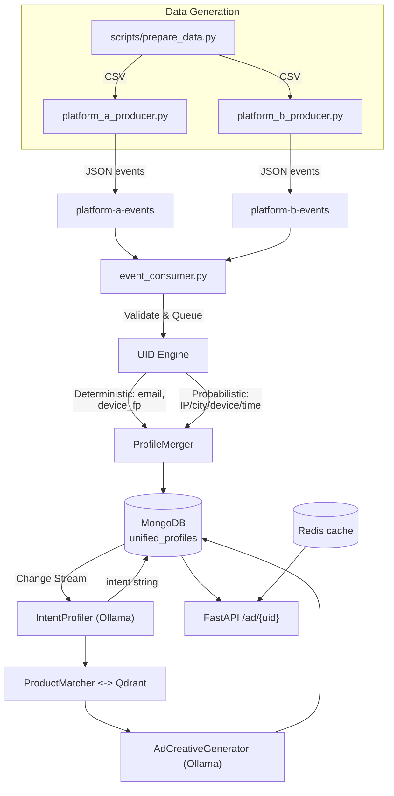

# CDP Agentic Ad Engine

A **privacy-centric Customer Data Platform** for cross-platform identity resolution and personalised advertising. Ingests clickstream events from two platforms, resolves anonymous sessions into unified global profiles, extracts purchasing intent via LLM (Ollama), and serves personalised ad creatives.

---

## Problem Statement

Users browse across multiple platforms (web, mobile, tablet) without always logging in. Traditional identity resolution relies on third-party cookies or deterministic PII matching, which breaks with privacy regulations (GDPR, CCPA) and blocking.

This system solves it using:
- **Deterministic matching** — hashed email and device fingerprint (SHA-256)
- **Probabilistic matching** — weighted signals (IP, location, device, time)
- **LLM-powered intent profiling** — semantic analysis of browsing behaviour

---

## Architecture



---

## Features

### Implemented

- **Cross-platform event ingestion** — Kafka/Redpanda topics per platform, validated against Pydantic schemas
- **Deterministic identity resolution** — SHA-256 hashed email and device fingerprint matching
- **Probabilistic identity scoring** — weighted composite of IP range (0.35), city (0.25), device type (0.20), time window (0.20); threshold 0.75
- **Unified profile store** — MongoDB with embedded event history, devices, locations, session links
- **LLM intent profiling** — Ollama (`qwen2.5:3b`) generates semantic intent summaries from browsing behaviour
- **Vector product matching** — Qdrant with `nomic-embed-text` for nearest-neighbour product search
- **Ad creative generation** — Ollama JSON output mode for personalised headline/body/CTA
- **FastAPI REST API** — 5 endpoints (`/ad`, `/event`, `/profile`, `/health`, `/metrics`) with Redis caching and rate limiting
- **Raw event data lake** — MinIO (S3-compatible) for partitioned JSONL storage
- **Docker Compose orchestration** — 7 services for local development
- **Kubernetes deployment** — Manifests for all components with KEDA autoscaling
- **CI/CD pipeline** — GitHub Actions (lint → test → build → deploy → drift-check)

### Not Implemented (Future)

- Authentication/authorization on API endpoints
- GDPR data deletion / user opt-out API
- End-to-end integration test suite
- A/B testing framework for ad creative variants
- Monitoring/alerting integration
- Multi-region high-availability deployment

---

## Tech Stack

| Layer | Technology |
|-------|-----------|
| Language | Python 3.12+ |
| Event streaming | Redpanda (Kafka API) |
| Database | MongoDB 7.0 |
| Vector store | Qdrant 1.10 |
| Object storage | MinIO (S3 API) |
| Cache | Redis 7-alpine |
| LLM | Ollama 0.3 (qwen2.5:3b, nomic-embed-text) |
| API framework | FastAPI |
| Data validation | Pydantic v2 |
| Async | asyncio + aiokafka + motor |
| Logging | structlog |
| Infrastructure | Docker Compose, K8s, Terraform |
| CI/CD | GitHub Actions |

---

## Project Structure

```
.
├── agents/                   # AI agents (IntentProfiler, ProductMatcher, AdCreative)
│   ├── ad_creative.py
│   ├── intent_profiler.py
│   └── product_matcher.py
├── api/
│   └── main.py               # FastAPI application (5 endpoints)
├── common/
│   ├── logging.py            # Structured logging (structlog)
│   ├── schemas.py            # Pydantic v2 data models
│   └── settings.py           # Ollama model configuration
├── consumers/
│   └── event_consumer.py     # Kafka consumer + MinIO archiver + UID queue
├── data/                     # Synthetic data (CSV, ground truth, product catalog)
├── docs/                     # Documentation
├── evidence/                 # Real-execution screenshots
├── infra/                    # Terraform infrastructure
├── k8s/                      # Kubernetes manifests
├── scripts/
│   ├── batch_reprofile.py    # Batch intent re-profiling
│   ├── prepare_data.py       # Synthetic data generator
│   └── uid_eval.py           # UID engine accuracy evaluation
├── simulators/
│   ├── platform_a_producer.py
│   └── platform_b_producer.py
├── tests/
│   ├── test_agents.py        # 19 tests
│   ├── test_api.py           # 4 tests
│   └── test_uid_engine.py    # 20 tests
├── uid_engine/
│   ├── deterministic.py      # Email + device fingerprint matching
│   ├── evaluate.py           # Evaluation framework (threshold 0.85 F1)
│   ├── merger.py             # MongoDB profile CRUD + Change Stream
│   └── probabilistic.py      # Weighted scoring (IP/city/device/time)
├── vector_store/
│   └── embed_catalog.py      # Qdrant product embedding
├── docker-compose.yml
├── Dockerfile
├── requirements.txt
└── pyproject.toml
```

---

## Setup Instructions

### Prerequisites

- Docker Desktop (or Docker + Docker Compose)
- Python 3.12+
- Ollama (optional, for local LLM — Docker service handles this)

### 1. Start Infrastructure

```bash
docker compose up -d
```

This starts: Redpanda (Kafka), MongoDB, Qdrant, MinIO, Redis, Ollama.

Wait for all services to show `healthy`:

```bash
docker ps --format "table {{.Names}}\t{{.Status}}"
```

### 2. Set Up Python Environment

```bash
python3 -m venv .venv
source .venv/bin/activate
pip install -r requirements.txt
pip install python-snappy    # Required for Redpanda compression
```

On macOS, set library path:

```bash
export DYLD_LIBRARY_PATH=/opt/homebrew/lib:$DYLD_LIBRARY_PATH
```

### 3. Generate Synthetic Data

```bash
python scripts/prepare_data.py --seed 42
```

Creates: `data/platform_a_events.csv`, `data/platform_b_events.csv`, `data/synthetic_ground_truth.csv`, `data/product_catalog.json`

### 4. Embed Product Catalog (Qdrant)

```bash
python vector_store/embed_catalog.py
```

---

## Running the System

### Step 1 — Produce Events

```bash
# Terminal 1: Platform A producer
python simulators/platform_a_producer.py --max-events 5000

# Terminal 2: Platform B producer
python simulators/platform_b_producer.py --max-events 5000
```

### Step 2 — Start Event Consumer

```bash
DYLD_LIBRARY_PATH=/opt/homebrew/lib python consumers/event_consumer.py
```

### Step 3 — Batch Profile (Intent Profiling)

```bash
python scripts/batch_reprofile.py --concurrency 5
```

### Step 4 — Run Evaluation

```bash
python scripts/uid_eval.py
```

### Step 5 — Start API Server

```bash
uvicorn api.main:app --host 0.0.0.0 --port 8000 --reload
```

---

## Evidence

Real-execution screenshots of the live running system:

| Screenshot | Description |
|-----------|-------------|
| `evidence/kafka.png` | Redpanda topics, consumer group, live offsets |
| `evidence/uid_engine.png` | Identity matching logs (email, device_fp, probabilistic) |
| `evidence/mongodb_profile.png` | Unified profile document with sessions and events |
| `evidence/intent_profile.png` | Ollama-generated intent summaries |
| `evidence/evaluation.png` | Evaluation metrics against 400 ground-truth pairs |
| `evidence/system_running.png` | All Docker containers, Ollama, consumer process |

---

## Results

### UID Engine Evaluation (400 ground-truth pairs)

| Metric | Deterministic | Probabilistic | Combined |
|--------|:------------:|:-------------:|:--------:|
| True Positives | 161 | 152 | 313 |
| False Positives | 180,037 | 0 | 180,037 |
| False Negatives | 39 | 48 | 87 |
| Precision | 0.0009 | 1.0000 | 0.0017 |
| Recall | 0.8050 | 0.7600 | 0.7825 |
| F1 Score | 0.0018 | 0.8636 | 0.0035 |

### Profile-Level Audit

| Metric | Value |
|--------|-------|
| Correct profiles | 92 |
| Over-merged profiles | 24 (all device_fingerprint) |
| Split identities | 87 |
| Profile precision | 0.7931 |
| Profile recall | 0.5140 |
| Profile F1 | 0.6237 |

### Key Findings

- **100% of over-merges** caused by device fingerprint collisions in synthetic data (26 fingerprints for 4,807 sessions)
- **Probabilistic matching achieved 0 false positives** — zero over-merges from scoring
- **Intent profiling completed for 689 of 694 profiles** (99.3% success rate)
- **54,669 real events** consumed through the live pipeline

---

## Future Improvements

- Production-grade device fingerprint with user agent parsing + browser feature detection
- Configurable matching pipeline order (deterministic first vs. parallel)
- Dedicated profile-level evaluation (avoid pair-level combinatorial inflation)
- Authentication/authorization for API endpoints
- GDPR compliance endpoints (data access, deletion, opt-out)
- End-to-end integration test suite
- Real-time monitoring with Prometheus/Grafana
- A/B testing framework for ad creative variants

---

## License

UNLICENSED — Internal project
