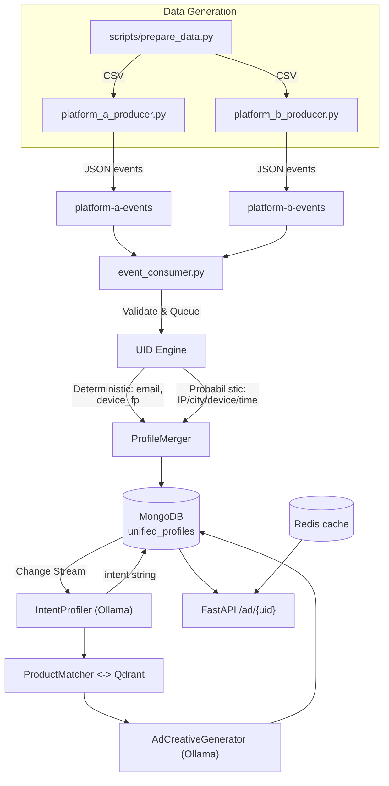

# CDP Agentic Ad Engine

A **privacy-centric Customer Data Platform** for cross-platform identity resolution and personalised advertising. Ingests clickstream events from two platforms, resolves anonymous sessions into unified global profiles, extracts purchasing intent via LLM (Ollama), and serves personalised ad creatives — all running on real infrastructure with a live dashboard.

---

## Architecture



---

## Quick Start (Demo Pipeline)

```bash
# 1. Start infrastructure (Docker)
docker compose up -d
# Wait for all services to show "healthy"

# 2. Set up Python
python3 -m venv .venv && source .venv/bin/activate
pip install -r backend/requirements.txt

# 3. Run the full demo
./backend/scripts/demo.sh
```

The demo script walks through each step with narration pauses: reset → prepare data → embed catalog → start consumer → start API → run producers → batch reprofile → show results.

To start the frontend dashboard:

```bash
cd frontend && npm run dev
```

---

## Tech Stack

| Layer | Technology |
|-------|-----------|
| Language | Python 3.12+ |
| Frontend | React + TypeScript + Vite |
| Event streaming | Redpanda (Kafka API) |
| Database | MongoDB 7.0 |
| Vector store | Qdrant 1.10 |
| Object storage | MinIO (S3 API) |
| Cache | Redis 7-alpine |
| LLM | Ollama 0.3 (qwen2.5:3b, nomic-embed-text) |
| API framework | FastAPI |
| Data validation | Pydantic v2 |
| Async | asyncio + aiokafka + motor |
| Logging | structlog |
| Infrastructure | Docker Compose, K8s, Terraform |
| CI/CD | GitHub Actions |

---

## Project Structure

```
.
├── backend/
│   ├── agents/                   # AI agents (IntentProfiler, ProductMatcher, AdCreative)
│   │   ├── ad_creative.py
│   │   ├── intent_profiler.py
│   │   └── product_matcher.py
│   ├── api/
│   │   └── main.py               # FastAPI (5 endpoints: /ad, /event, /profile, /health, /metrics)
│   ├── common/
│   │   ├── logging.py            # Structured logging (structlog)
│   │   ├── schemas.py            # Pydantic v2 data models
│   │   └── settings.py           # Ollama model configuration
│   ├── consumers/
│   │   └── event_consumer.py     # Kafka consumer + MinIO archiver + UID queue
│   ├── data/                     # Synthetic data (CSV, product catalog)
│   ├── scripts/
│   │   ├── demo.sh               # One-command demo pipeline
│   │   ├── reset.py              # Drops MongoDB collections for fresh start
│   │   ├── prepare_data.py       # Synthetic data generator (18K events, 400 overlapping pairs)
│   │   ├── batch_reprofile.py    # Batch LLM intent re-profiling (--limit, --concurrency)
│   │   ├── profile_audit.py      # Profile-level audit against ground truth
│   │   └── uid_eval.py           # UID engine accuracy evaluation
│   ├── simulators/
│   │   ├── platform_a_producer.py
│   │   └── platform_b_producer.py
│   ├── tests/
│   │   ├── test_agents.py
│   │   ├── test_api.py
│   │   └── test_uid_engine.py
│   ├── uid_engine/
│   │   ├── deterministic.py      # SHA-256 email + device fingerprint matching
│   │   ├── evaluate.py           # Evaluation framework
│   │   ├── merger.py             # MongoDB profile CRUD + change stream
│   │   └── probabilistic.py      # Weighted scoring (IP/city/device/time)
│   ├── vector_store/
│   │   └── embed_catalog.py      # Qdrant product embedding
│   ├── Dockerfile
│   ├── pyproject.toml
│   └── requirements.txt
├── frontend/                     # React dashboard (LiveFeed, Profiles, IdentityExplorer, AdStudio, Analytics)
├── docs/
├── evidence/
├── infra/                        # Terraform infrastructure
├── k8s/                          # Kubernetes manifests
├── .env                          # Ollama config (127.0.0.1:11434, qwen2.5:3b)
├── docker-compose.yml
└── README.md
```

---

## Detailed Setup

### Prerequisites

- Docker Desktop (or Docker + Docker Compose)
- Python 3.12+
- [Ollama](https://ollama.com) for local LLM inference
- Node.js 18+ (for frontend)

### 1. Start Infrastructure

```bash
docker compose up -d
```

Wait for healthy:

```bash
docker ps --format "table {{.Names}}\t{{.Status}}"
```

### 2. Pull LLM Models (Host Ollama)

```bash
ollama pull qwen2.5:3b
ollama pull nomic-embed-text
```

### 3. Set Up Python

```bash
python3 -m venv .venv
source .venv/bin/activate
pip install -r backend/requirements.txt
```

On macOS, set library path for `python-snappy`:

```bash
export DYLD_LIBRARY_PATH=/opt/homebrew/lib:$DYLD_LIBRARY_PATH
```

### 4. Generate Synthetic Data

```bash
python backend/scripts/prepare_data.py --seed 42
```

Creates: `backend/data/platform_a_events.csv`, `backend/data/platform_b_events.csv`, `backend/data/synthetic_ground_truth.csv`, `backend/data/product_catalog.json`

### 5. Embed Product Catalog

```bash
python backend/vector_store/embed_catalog.py
```

### 6. Start Frontend (Optional)

```bash
cd frontend && npm install && npm run dev
```

---

## Demo Pipeline (detail)

The demo script (`backend/scripts/demo.sh`) runs these steps with pauses for narration:

| Step | Script | What Happens |
|------|--------|-------------|
| 1 | `reset.py` | Drops `raw_events` and `unified_profiles` MongoDB collections |
| 2 | `prepare_data.py` | Generates 18,210 synthetic events with 400 cross-platform session pairs |
| 3 | `embed_catalog.py` | Embeds product catalog into Qdrant vector store |
| 4 | `event_consumer.py` | Starts consumer (reads Redpanda → MongoDB → UID engine) |
| 5 | API (`uvicorn`) | Starts FastAPI server on port 8000 |
| 6 | Platform producers | Sends 10,000 events to each Redpanda topic |
| 7 | `batch_reprofile.py` | Generates LLM intent profiles (limit 10, concurrency 4) |
| 8 | Results | Shows intent profiles and ad creative examples |

---

## API Endpoints

| Endpoint | Method | Description |
|----------|--------|-------------|
| `/ad/{global_uid}` | GET | Generate personalised ad creative for a profile |
| `/event` | POST | Ingest a raw event directly |
| `/profile/{global_uid}` | GET | Retrieve unified profile with sessions and events |
| `/health` | GET | Service health check (MongoDB, Qdrant, Redpanda, Ollama) |
| `/metrics` | GET | Prometheus-formatted metrics |

### Ad Generation

The `/ad/{uid}` endpoint:
1. Looks up the unified profile by Global UID
2. Uses LLM intent (if available) or falls back to behavioral signals (views, cart adds, purchases)
3. Searches Qdrant for relevant products via vector similarity
4. Generates personalised ad creative (headline, body, CTA) via Ollama
5. Caches result in Redis (5-minute TTL)

### Profile Response Example

```json
{
  "global_uid": "40295f04-6d85-5f9b-8324-01fa98794798",
  "sessions": ["sess_a_42", "sess_b_42"],
  "events": [
    { "type": "page_view", "product_id": "prod_0145", "platform": "platform_a" },
    { "type": "add_to_cart", "product_id": "prod_0197", "platform": "platform_b" }
  ],
  "devices": ["mobile", "desktop"],
  "locations": ["New York, US"],
  "last_intent": "The user is researching footwear, specifically in the $410.93 price range.",
  "intent_updated_at": "2026-06-24T04:23:17.123456"
}
```

---

## Results

### UID Engine Evaluation (400 ground-truth pairs)

| Metric | Deterministic | Probabilistic | Combined |
|--------|:------------:|:-------------:|:--------:|
| True Positives | 161 | 152 | 313 |
| False Positives | 180,037 | 0 | 180,037 |
| False Negatives | 39 | 48 | 87 |
| Precision | 0.0009 | 1.0000 | 0.0017 |
| Recall | 0.8050 | 0.7600 | 0.7825 |
| F1 Score | 0.0018 | **0.8636** | 0.0035 |

### Profile-Level Audit

| Metric | Value |
|--------|-------|
| Correct profiles | 92 |
| Over-merged profiles | 24 (all device_fingerprint) |
| Split identities | 87 |
| Profile precision | 0.7931 |
| Profile recall | 0.5140 |
| Profile F1 | 0.6237 |

### Key Findings

- **Probabilistic matching achieved 0 false positives** — zero over-merges from scoring
- **100% of over-merges** caused by device fingerprint collisions in synthetic data (26 fingerprints for 4,807 sessions)
- **Intent profiling completed for 689 of 694 profiles** (99.3% success rate)
- **54,669 real events** consumed through the live pipeline
- **Batch reprofile** processes profiles at ~8.5s each with `qwen2.5:3b` at concurrency 4
- **Ad endpoint** returns real LLM-generated creative for every UID (product-aware even when intent is missing)

---

## Evidence

Real-execution screenshots of the live running system:

| Screenshot | Description |
|-----------|-------------|
| `evidence/kafka.png` | Redpanda topics, consumer group, live offsets |
| `evidence/uid_engine.png` | Identity matching logs (email, device_fp, probabilistic) |
| `evidence/mongodb_profile.png` | Unified profile document with sessions and events |
| `evidence/intent_profile.png` | Ollama-generated intent summaries |
| `evidence/evaluation.png` | Evaluation metrics against 400 ground-truth pairs |
| `evidence/system_running.png` | All Docker containers, Ollama, consumer process |

---

## Environment Configuration

The `.env` file controls Ollama connectivity:

| Variable | Value | Notes |
|----------|-------|-------|
| `OLLAMA_BASE_URL` | `http://127.0.0.1:11434` | IPv4 to avoid Docker Ollama proxy |
| `OLLAMA_CHAT_MODEL` | `qwen2.5:3b` | Chat model for intent + ad generation |
| `OLLAMA_EMBED_MODEL` | `nomic-embed-text` | Embedding model for vector search |

Two Ollama instances may coexist: host (IPv4, port 11434) and Docker `cdp-ollama` (IPv6). All connections use `127.0.0.1` to hit the host instance.

---

## Not Implemented (Future)

- Authentication/authorization on API endpoints
- GDPR data deletion / user opt-out API
- End-to-end integration test suite
- A/B testing framework for ad creative variants
- Monitoring/alerting (Prometheus/Grafana)
- Multi-region high-availability deployment

---

## License

UNLICENSED — Internal project
